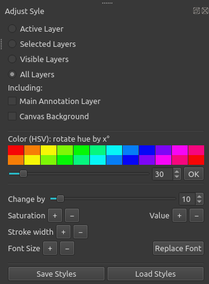

# QGIS Plugin Adjust Style
Experimental [QGIS Plugin](https://plugins.qgis.org/plugins/qgis_adjust_style/) to adjust the style of a map with a few clicks instead of altering every single symbol for many categories or a number of label rules. It offers a quick way to adjust the style of all layers (or selected layers) in a consistant way, to check out how different colors / stroke widths / fonts work for a project, or to apply styles to another project. 

It allows to: 
- adjust color of all symbols (including color ramps and any number of symbol layers) and labels using the HSV color model (rotate hue, change saturation and value)
- change line thickness (i.e. stroke width of all symbols / symbol borders)
- change font size of all labels
- replace a font family used in labels with another font family
- save / load the styles of all layers at once into/from a given folder.

## Install
The plugin is in the [QGIS Plugins Repository](https://plugins.qgis.org/plugins/qgis_adjust_style/) and can be installed directly from QGIS (menu: Plugins > Manage and Install Plugins). In the settings of the plugin manager, the checkbox to also show experimental plugins must be checked.

Alternatively, copy (or git clone) the folder with the code into your QGIS plugin folder and enable the plugin in QGIS (menu: Plugins > Manage and Install Plugins).

## Usage
Start the plugin from the Plugin menu or the plugin toolbar, a dockwidget opens on the right side of the main window.

### Select Layers
First, select the layers you want to work on. Possible choices:
- Active Layer
- Selected Layers
- Visible Layers
- All Layers

### Change Color
Adjusting colors works in the HSV color model. That means you can rotate the hue of the HSV colors as you would rotate a color wheel: set the degree of the rotation and hit "OK". The color grid above the slider works as a preview.

To adjust saturation and value (= brightness), click on the respective plus and minus buttons. Be careful: You can't use the plus and minus button to undo the changes already made since the values of saturation and HSV value stay in the interval ranging from 0 to 255 and any color arriving at these borders can't be moved back in an consistent way. It is good practice to save the layer styles before using these buttons!

### Stroke Width
Change the stroke width of lines and the borders of symbols of polygons and points with clicks on the plus and minus buttons.

### Labels
Note: Changing the color of layers also changes the color of labels (text, buffer and background).

#### Font Size
Use the plus / minus buttons to change the font size of labels in increments of 0.5 pt.

#### Replace Font
Choose the font family to be replaced and select a new font family.

#### Save and Load Styles
These buttons provide a quick way to save the styles of all (or all selected) layers. You only need to select a folder. The filename of the QML files corresponds to the layer name (with bad characters replaced by underscore). If there are several layers of the same name, you will get several files with an index value appended. 

Should even work to save the styles of one project and load them in another one if the layer names match. 

## Change Log
### Git
- Change stroke width and font size by 5 % instead of a small absolute value, to make it work in map units
- Changing stroke works for most renderer and symbol types now, including subsymbols (such as marker line)
- Shapeburst and lineburst: correctly change color ramp and color2
- Raster: Change color ramp of single band pseudo color renderer
- Mark strings for translation
- Add german translation
- Flag project as modified ("dirty") after changing / loading the style
- Do not crash on QgsNullSymbolRenderer
- Fix message on loading styles with style files for only some layers

### 0.2 (2023-05)
- Do not crash on a QgsGroupLayer (this is a new QGIS feature)
- Fix crash of changing stroke width with renderers other than line and simple fill

### 0.1 (2023-05)
- Initial release

## Known Bugs / Limitations
- Annotations (annotation layers) are not changed
- Color ramps: color brewer ramps are not modified 
- Layer effects are not modified 
- Changing stroke width does not work for symbol layers based on QgsAbstractBrushedLineSymbolLayer such as lineburst

